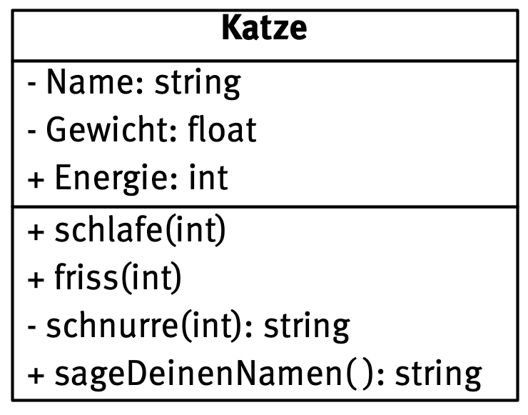

# Objektorientierung in Python

## Eine Klasse definieren

Lassen wir die Katzen-Klasse nicht aus den Augen.



In Python sieht die komplette Definition der Klasse dann zum Beispiel so aus.

```python
class Katze():
    
    # Konstruktor
    def __init__(self):
        self.__name = ""
        self.__gewicht = 0.0
        self.energie = 100
    
    # Methoden
    def schlafe(self, energiegewinn):
        self.energie += energiegewinn
    
    def friss(self, energiegewinn):
        self.energie += energiegewinn
        
    def __schnurre(self, dauer):
        if dauer < 30:
            return "Grrrrrrrrrr"
        else:
            return "Hrrrrrrmrrrrrrr"
        
    def sageDeinenNamen(self):
        return self.__name
```

Ein Objekt der Klasse Katze erzeugt man dann durch Aufruf des **Konstruktors** in der Shell. (Öffentliche!) Methoden und (öffentliche!) Attribute kann man mittels Punktschreibweise aufrufen.

```
>>> Garfield = Katze()
>>> Garfield.energie
100
>>> Garfield.friss(13)
>>> Garfield.energie
113
```

*Obacht! Bevor du Objekte von Klassen erzeugen kannst, musst du den Quelltext mit der Klassendefinition einmal ausführen.*


t> Bringe den Quelltext im Programm Thonny zum laufen. Mache dir den Unterschied zwischen der Methode *schnurre* und der Methode *schlafe* klar. 

t> Erzeuge zwei weitere Objekte der Klasse *Katze*.

t> Ergänze in deinem Quelltext eine Methode *ändereMeinenNamen*, in der man der Katze einen Namen geben kann.

t> Ergänze eine Methode *trinke(self, energiegewinn)*, sageDeineEnergie( ) und erkläre, was man am Quelltext verändern müsste, um ein Schnurren der Katze erzwingen zu können. (*"Kann man nicht, es ist eine Katze" gilt nicht*)

i> Als weitere Übungsaufgaben beschäftige dich mit Aufgabe 2.2 des Abiturs von 2017. Mache dich zunächst noch einmal mit dem Aufbau von Struktogrammen vertraut. Du kannst dich [knapp](http://www.wspiegel.de/pykurs/python08.html) oder [ausführlich](https://www.inf-schule.de/programmierung/imperativeprogrammierung/konzepteimp/ablaufmodellierung/beispiel_zahlenraten) mit ihnen auseinander setzen. Du findest im Zusatz-Tafelwerk ebenfalls eine Übersicht.


# Arbeit mit Zeichenketten in Python

Erinnere dich z.B. [mittels dieser Webseite](https://www.inf-schule.de/programmierung/imperativeprogrammierung/fallstudien/modularisierung/fallstudie_verschluesselungcaesar) an die Verwendung von Zeichenketten in Python. 

t> Beschäftige dich mit Aufgabe 2 des Abiturs von 2019


