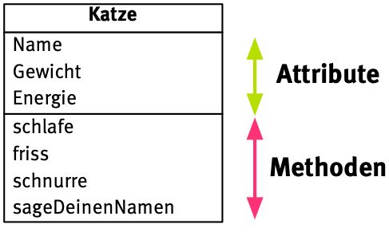

# Softwaretechnik

Gute Kurse:

- https://www.python-kurs.eu/python3_klassen.php 
  sehr kurze und prägnante Einführung
- https://www.inf-schule.de/modellierung/ooppython
  sehr ausführliche Einführung

## Die Objektorientierte Brille

Setzen Informatiker\*innen ihre objektorientierte Brille auf, sehen sie nur noch **Objekte** , die zu irgendwelchen **Klassen** zusammen gefasst werden können. So gibt es zum Beispiel lauter unterschiedliche  Objekte (manchmal bezeichnet man sie auch als **Instanzen**), die alle der Klasse *Katze* angehören. 

Sie haben gemeinsame **Attribute**, also Eigenschaften und auch **Methoden**, die sie alle ausführen können (genauer: die man an ihnen vollziehen kann). Man stellt diese Informationen in einer **Klassenkarte** dar.

Einzelne Objekte aus dieser Klasse weisen nun die gleichen Attribute und Methoden auf, wie die Klasse – die **Attributwerte** sind aber unterschiedlich. 

t> Lege Objektkarten für zwei weitere Objekte der Klasse Katze an.

Egal ob Primär- oder Sekundärquelle, beide können Fake sein. Prüfe daher in beiden Fällen nach, ob die Informationen stimmen.

## Wettbewerb 

Wir haben euch schwerer werdende Aufgaben zusammengestellt. Stellt in Gruppen euer ganzes Können unter beweis und knackt unsere Rätsel. Welches Team schafft wohl die meisten?

i> Hast du Lust auf noch mehr Rätsel? [@quitime veröffentlicht bei Twitter](https://twitter.com/quiztime) beständig Rätsel für Erwachsene.