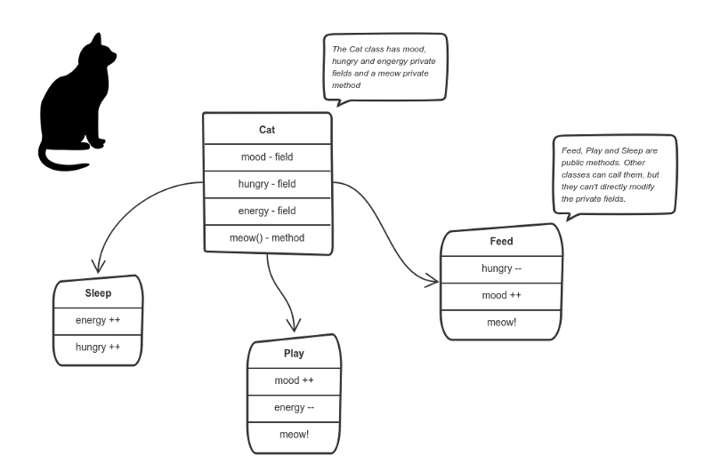
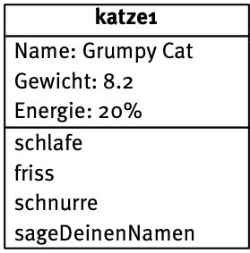

# Softwaretechnik

Gutes Material:

- https://www.python-kurs.eu/python3_klassen.php 
  sehr kurze und prägnante Einführung
  
- https://www.inf-schule.de/modellierung/ooppython
  sehr ausführliche Einführung
  
- https://www.freecodecamp.org/news/object-oriented-programming-concepts-21bb035f7260/
  
  ein englischer Text, aber dafür für 6-jährige

## Die Objektorientierte Brille

Setzen Informatiker\*innen ihre objektorientierte Brille auf, sehen sie nur noch **Objekte** , die zu irgendwelchen **Klassen** zusammen gefasst werden können. So gibt es zum Beispiel lauter unterschiedliche  Objekte (manchmal bezeichnet man sie auch als **Instanzen**), die alle der Klasse *Katze* angehören. 

Sie haben gemeinsame **Attribute**, also Eigenschaften und auch **Methoden**, die sie alle ausführen können (genauer: die man an ihnen vollziehen kann). Man stellt diese Informationen in einer **Klassenkarte** dar.

Einzelne Objekte aus dieser Klasse weisen nun die gleichen Attribute und Methoden auf, wie die Klasse – die **Attributwerte** sind aber unterschiedlich. 

t> Lege Objektkarten für zwei weitere Objekte der Klasse Katze an.

t> Überlege dir zwei andere Beispiele für Objekte und Klassen.

## Datenkapselung

Eines der Grundprinzipien der Objektorientierten Modellierung ist die **Datenkapselung**. Dieses Prinzip sorgt dafür, dass der Zugriff auf Methoden und Attribute explizit durch die Klasse geregelt wird. Attribute und Methoden können entweder die Sichtbarkeit **private** (-) oder **public** (+) haben. Private bedeutet, dass das Attribut oder die Methode nur vom Objekt selbst verwendet werden kann – Public dass der Zugriff auch von außerhalb, beispielsweise durch ein anderes Objekt möglich ist.

Häufig kommt es beispielsweise vor, dass der Zugriff auf bestimmte Attribute nur über eine entsprechende Methode möglich ist. 

t> Überlege dir hinreichend plausible Gründe für die Wahl der Sichtbarkeiten im obigen Beispiel.

Aus dieser erweiterten Form der Klassenkarte gehen neben der Sichtbarkeit noch **Parameter** für einzelne Methoden und die **Datentypen** für die Attribute hervor. 

w> Du solltest die Bedeutung der Datentypen *Integer*, *Float*, *Boolean* und *String* kennen.

