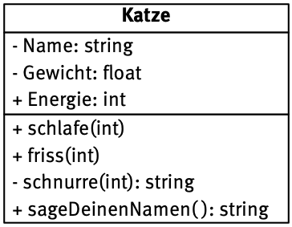
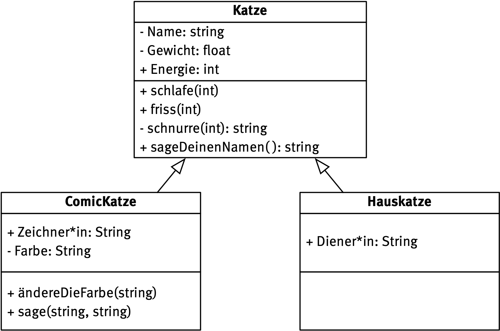
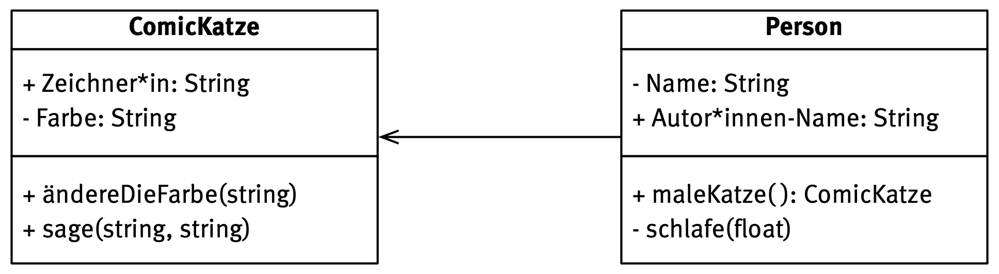

# Softwaretechnik

Gutes Material:

- https://www.python-kurs.eu/python3_klassen.php 
  sehr kurze und prägnante Einführung
  
- https://www.inf-schule.de/modellierung/ooppython
  sehr ausführliche Einführung
  
- https://www.freecodecamp.org/news/object-oriented-programming-concepts-21bb035f7260/

  ein englischer Text, aber dafür für 6-jährige

- weitere Literatur-Hinweise im Material-Ordner

Diese Zusammenfassung grundlegenden Wissens besteht aus zwei Bestandteilen:

[Teil 1: Objektorientierte Modellierung](/Softwaretechnik/OOM.md)

## Die Objektorientierte Brille

Setzen Informatiker\*innen ihre objektorientierte Brille auf, sehen sie nur noch **Objekte** , die zu irgendwelchen **Klassen** zusammen gefasst werden können. So gibt es zum Beispiel lauter unterschiedliche  Objekte (manchmal bezeichnet man sie auch als **Instanzen**), die alle der Klasse *Katze* angehören. 

Sie haben gemeinsame **Attribute**, also Eigenschaften und auch **Methoden**, die sie alle ausführen können (genauer: die man an ihnen vollziehen kann). Man stellt diese Informationen in einer **Klassenkarte** dar.

Einzelne Objekte aus dieser Klasse weisen nun die gleichen Attribute und Methoden auf, wie die Klasse – die **Attributwerte** sind aber unterschiedlich. 

t> Lege Objektkarten für zwei weitere Objekte der Klasse Katze an.

t> Überlege dir zwei andere Beispiele für Objekte und Klassen.

## Datenkapselung

Eines der Grundprinzipien der Objektorientierten Modellierung ist die **Datenkapselung**. Dieses Prinzip sorgt dafür, dass der Zugriff auf Methoden und Attribute explizit durch die Klasse geregelt wird. Attribute und Methoden können entweder die Sichtbarkeit **private** (-) oder **public** (+) haben. Private bedeutet, dass das Attribut oder die Methode nur vom Objekt selbst verwendet werden kann – Public dass der Zugriff auch von außerhalb, beispielsweise durch ein anderes Objekt möglich ist.

Häufig kommt es beispielsweise vor, dass der Zugriff auf bestimmte Attribute nur über eine entsprechende Methode möglich ist. 

t> Überlege dir hinreichend plausible Gründe für die Wahl der Sichtbarkeiten im obigen Beispiel.

Aus dieser erweiterten Form der Klassenkarte gehen neben der Sichtbarkeit noch **Parameter** für einzelne Methoden und die **Datentypen** für die Attribute hervor. Die Methode *schlafe* erhält z.B. einen Integer-Wert, während die Methode *sageDeinenName* einen String-Wert zurückliefert. 

w> Du solltest die Bedeutung der Datentypen *Integer*, *Float*, *Boolean* und *String* kennen.

t> Formuliere Übergabe- und Rückgabewert für die übrigen Methoden.

## Vererbung, Generalisierung und Spezialisierung

Ausgehend von einer bestehenden allgemeinen **Klasse** kann man mittels **Vererbung** verwandte Klassen definieren. Die so entstehende **abgeleitete Klasse** erbt Methoden und Attribute der **Basisklasse**. Ableleitete Klassen haben womöglich weitere oder veränderte Eigenschaften. 

Die abgeleitete Klasse hat damit nicht nur alle Attribute der Klasse *Katze*, sondern auch zusätzliche wie z.B. eine Farbe. Bei den Methoden verhält es sich ähnlich. 

Im obigen Beispiel ist die Klasse *Katze* eine **Generalisierung** der Klassen *ComicKatze* und *Hauskatze*, während umgekehrt die Klassen *ComicKatze* und *Hauskatze* eine **Spezialisierung** der Klasse *Katze* sind.

t> Überlege dir für deine oben gewählten Beispielszenarien mögliche Generalisierungen oder Spezialisierungen deiner Klassen.

## Weitere Beziehungen zwischen Klassen

Eine schwächere Form der Beziehung zwischen Klassen ist eine **Assoziation** (KENNT-Beziehung). Sie beschreibt eine Verbindung zwischen zwei oder mehreren Klassen.

In der Regel gibt man am Ende von Assoziationen **Multiplizitäten** an. Sie besagen, wie viele der Objekte in Relation zu den anderen Objekten der Relation stehen.

Schlussendlich bleiben noch zwei häufig auftretende Beziehungen, die daher einen eigenen Namen erhalten haben. Sie beschreiben Beziehungen zwischen einem Ganzen und seinen Teilen.

- **Aggregationen** verknüpfen voneinander unabhängige Klassen (BESTEHT AUS-Beziehung)
- **Kompositionen** als Spezialfall einer Assoziation verknüpft zwei Klassen, bei der die eine die andere (HAT-Beziehung). Die eine Klasse existiert nicht ohne die andere.

